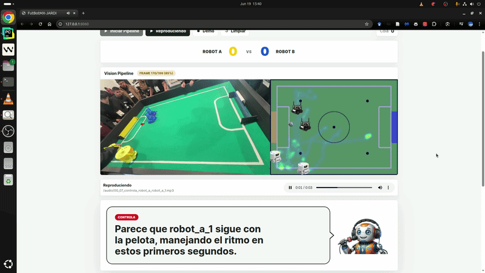
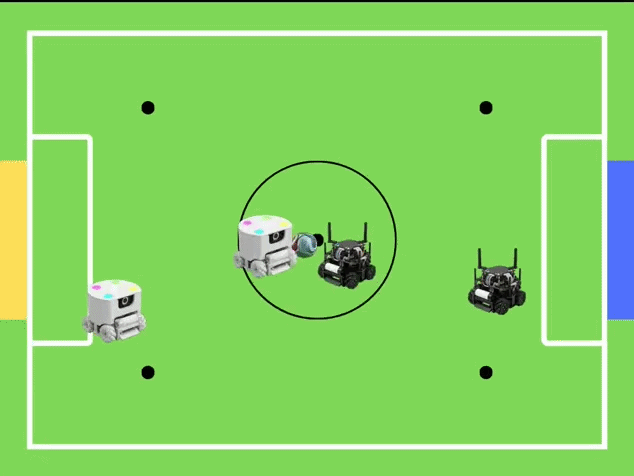
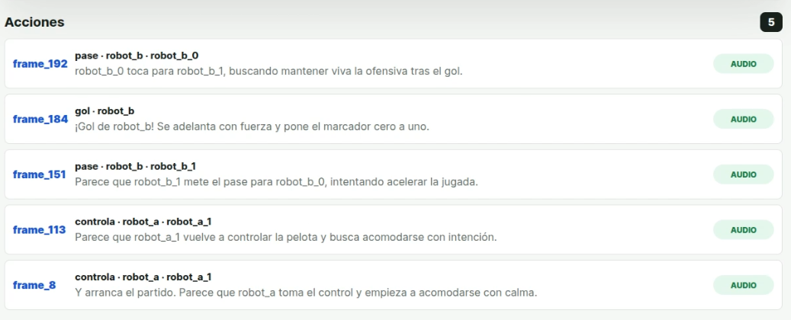
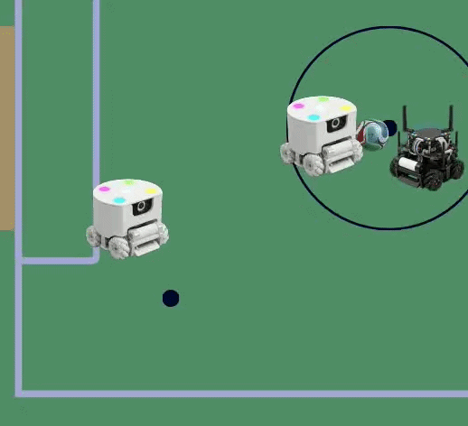
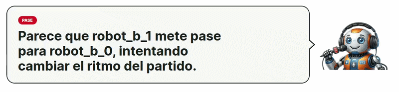

# FutBotMX26-JARDI

[▶️ Ver demo en Youtube](https://www.youtube.com/watch?v=oMxEaP6SfW4)

[📱 Ver reel en Instagram](https://www.instagram.com/reel/DZy-EQ2AKmV/?igsh=c29vdXN4OHJlOG9s)

Sistema de visión por computadora para analizar, visualizar y narrar partidos de fútbol de robots. El pipeline detecta y rastrea robots y pelota en el video, proyecta sus posiciones a una vista cenital de la cancha, reconoce eventos de juego (gol, pase, posesión del balón) y genera narración automática con voz sintética.



## Descripción del enfoque y arquitectura

El proyecto sigue un pipeline modular que procesa un video de entrada en etapas secuenciales:

```
video de entrada
  → 1. SAM tracking (segmentación + tracking)
  → 2. Homografía móvil (vista cenital)
  → 3. Reconocimiento de actividad (gol, pase, control)
  → 4. Mapa de calor y visualización
  → 5. Narración automática con GPT + ElevenLabs
```

Cada etapa está encapsulada en un paquete Python independiente. El archivo `main.py` orquesta todo el flujo: ejecuta tracking SAM3, estima la homografía frame a frame, detecta acciones, renderiza un video de dos paneles (vista original + vista cenital) y expone una web app local para recibir y reproducir la narración en vivo.

**Decisiones arquitectónicas principales:**

- **SAM3 como base de tracking:** se usa el modelo Segment Anything 3 de Meta para segmentar y rastrear la pelota y los robots de forma semántica, sin necesidad de entrenar un detector específico para cada video.
- **Homografía secuencial con ECC:** en lugar de alinear cada frame directamente contra la cancha, se estima el movimiento de cámara entre frames consecutivos y se compone con una homografía de referencia calibrada manualmente. Esto da estabilidad ante movimientos suaves de cámara y oclusiones parciales.
- **Reconocimiento de actividad basado en reglas:** los eventos de juego se derivan de la geometría de las posiciones en la cancha (proximidad de la pelota a robots, entrada en zonas de gol, etc.). Es rápido, interpretable y no requiere datos etiquetados.
- **Desacoplamiento de narración:** el narrador corre en un servidor HTTP local con cola de acciones. El detector de acciones publica eventos vía `POST /api/actions`, y un worker genera el texto con GPT y el audio con ElevenLabs. Esto permite ejecutar el pipeline de visión y la narración en la misma máquina o separarlas.

## Estructura del repositorio

```text
futbotmx26_JARDI/
├── main.py                           # Orquestador del pipeline + servidor web
├── futbotmx26.yml                    # Entorno Conda
├── .env.example                      # Variables de entorno para narración
├── futbot_sam/                       # Tracking multi-objeto con SAM3
├── futbot_homography/                # Homografía de referencia + tracking secuencial
├── futbot_activity_recognition/      # Detector de gol, pases y control
├── futbot_heatmap/                   # Acumulación y visualización de posiciones
├── futbot_narration/                 # Generación de narración con GPT y ElevenLabs
├── scripts/                          # Utilerías de calibración, homografía y narración
├── configs/                          # Configuraciones por video
├── web/narration_live/               # Interfaz web para narración en vivo
├── docs/                             # Documentación detallada de cada módulo
└── examples/                         # Ejemplos de acciones para narración
```

## Etapas del pipeline

### 1. SAM tracking - `futbot_sam/`

Segmenta y rastrea la pelota y los robots a lo largo del video. SAM3 recibe un prompt de texto (por ejemplo, `"robot"` o `"orange ball"`) y, opcionalmente, un bounding box en el frame inicial para inicializar el objeto. Cada video tiene su propia configuración de clases en `configs/tracking/tracking_classes_{video_id}.json`.

Salida: máscaras binarias por frame y por clase, con las que se extraen los centroides de los objetos.

- Documentación: `docs/sam.md`


### 2. Homografía móvil - `futbot_homography/`

Convierte los centroides detectados en el frame original a coordenadas de la cancha cenital.

- Se calibra una homografía de referencia `H_ref` desde el primer frame hacia `assets/cancha_1_10.png` usando puntos correspondientes.
- Para cada frame posterior se estima la transformación afin respecto al frame anterior con `cv2.findTransformECC` sobre una imagen de alineamiento construida a partir de las líneas blancas y la zona verde de la cancha.
- Se acumulan las transformaciones y se compone con `H_ref` para obtener la homografía final: `H_t = H_ref @ T_t`.

- Documentación: `docs/homografia_video.md`



### 3. Reconocimiento de actividad - `futbot_activity_recognition/`

Detecta eventos de juego usando las posiciones proyectadas en la cancha:

- **Gol:** la pelota está cerca de un robot y, en el siguiente frame, entra a la zona de gol del equipo contrario.
- **Pase:** la pelota pasa de un robot a otro del mismo equipo dentro de un umbral de proximidad.
- **Control:** un robot mantiene la pelota cerca durante un número mínimo de frames.

Las zonas de gol se configuran en `configs/roi/goal_zones_{video_id}.json`.

- Documentación: `docs/activity_recognition.md`



### 4. Mapa de calor y visualización - `futbot_heatmap/` + `main.py`

- Se acumulan las posiciones de los robots en una matriz de la cancha.
- Se aplica suavizado gaussiano, raíz cuadrada y normalización para generar un mapa de calor.
- El video de salida combina dos paneles: frame original con overlay de SAM y vista cenital con mapa de calor e íconos de robots/pelota.

- Documentación: `docs/heatmap.md`



### 5. Narración automática - `futbot_narration/`

Recibe eventos detectados y produce comentario en español con audio:

- **GPT** genera un texto de comentarista en vivo usando el contexto reciente del partido.
- **ElevenLabs** convierte el texto a audio MP3.
- El servidor web expone `POST /api/actions` para recibir eventos y un canal SSE para actualizar la interfaz en `http://127.0.0.1:8060`.

- Documentación: `docs/narracion.md`



## Requisitos de hardware

El entorno de desarrollo y pruebas usó la siguiente configuración:

- **GPU:** NVIDIA GeForce RTX 4080 SUPER
- **RAM:** 32 GB
- **CPU:** Intel Core i7-12700K

SAM3 y la generación de audio con ElevenLabs consumen la mayor parte de los recursos. Para reproducir el pipeline completo se recomienda una GPU con al menos 16 GB de VRAM y 32 GB de RAM.

## Instalación y reproducción paso a paso

### 1. Clonar el repositorio

```bash
git clone https://github.com/jairock282/futbotmx26_JARDI.git
cd futbotmx26_JARDI
```

### 2. Instalar SAM3

Este proyecto depende del paquete `sam3` del repositorio oficial de Meta:

```text
https://github.com/facebookresearch/sam3/tree/main
```

Clona e instala SAM3 según las instrucciones del repositorio oficial, asegurándote de que el paquete `sam3` sea importable desde el entorno de este proyecto.

### 3. Crear el entorno Conda

El archivo `futbotmx26.yml` contiene el entorno completo, incluyendo PyTorch, OpenCV, dependencias de CUDA y el paquete `sam3`. Requiere que tengas instalado [Conda](https://docs.conda.io/projects/conda/en/latest/user-guide/install/index.html).

```bash
conda env create -f futbotmx26.yml
conda activate futbotmx26
```

### 4. Configurar variables de entorno

Copia el archivo de ejemplo y completa tus llaves de API:

```bash
cp .env.example .env
```

Edita `.env` con al menos:

```bash
OPENAI_API_KEY=tu_api_key_de_openai
ELEVENLABS_API_KEY=tu_api_key_de_elevenlabs
```

Las demás variables ya tienen valores por defecto para narración en vivo.

### 5. Preparar datos y configuraciones por video

Para cada video necesitas:

- **Frames extraídos** en `data/frames/{SAMPLE_ID}/` (se cuenta con un código en utils/get_frames.py). 
- **Configuración de tracking** en `configs/tracking/tracking_classes_{sid}.json`. Usa `configs/tracking_classes.example.json` como plantilla.
- **Puntos de homografía** en `configs/calibrations/homography_points_{sid}.json`. Usa `configs/homography_points.example.json` como plantilla.
- **Zonas de gol** en `configs/roi/goal_zones_{sid}.json`.
- **Imagen de cancha** en `assets/cancha_1_10.png`.

Puedes calibrar la homografía manualmente con:

```bash
python scripts/calibrate_homography.py
```

### 6. Ejecutar el pipeline completo

```bash
python main.py
```

Esto inicia el servidor web en `http://127.0.0.1:8060` y arranca el pipeline de visión en un hilo separado. El video procesado se guarda en `outputs/` y la narración se reproduce en la web app.

## Uso de la web app

Abre `http://127.0.0.1:8060` en el navegador:

1. Presiona el botón de **Audio** para habilitar la reproducción.
2. Inicia el pipeline desde la interfaz o envía eventos manualmente.
3. Cuando el detector publica un evento, aparece en la UI y se reproduce el audio generado.

También puedes enviar acciones manualmente desde terminal:

```bash
curl -X POST http://127.0.0.1:8060/api/actions \
  -H "Content-Type: application/json" \
  -d '{"timestamp":"00:42","type":"gol","team":"blanco","robot_id":"B4","score":{"blanco":1,"negro":0},"confidence":0.97}'
```

## Documentación adicional

Cada módulo tiene su propia documentación detallada en la carpeta `docs/`:

- `docs/sam.md` - Tracking con SAM3
- `docs/homografia_video.md` - Homografía y vista cenital
- `docs/activity_recognition.md` - Reconocimiento de actividad
- `docs/heatmap.md` - Mapa de calor
- `docs/narracion.md` - Narración automática

## Notas

- El entorno usa **Python 3.12** y el entorno Conda se llama `futbotmx26`.
- `outputs/` está ignorado por `git`; no se versionan videos ni audios generados.
- Las llaves de API nunca deben subirse al repositorio; `.env` está en `.gitignore`.
